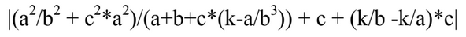
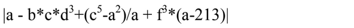

# Lab work № 1

### 1. Write a program to solve the example (by options). Consider checking for division by zero. All required variables the user enters through the console. Record |example| means "to take module”, i.e. if the value is negative, then change sign from minus to plus.
- ### Option 1. 
- ### Option 4. 
---
# Result:

- the choice of task and option is made through functions in the following sequence: _task_choose()_ -> _task_num()_ -> _option_num()_
- for the correct input of the value, the function  is implemented _input_float()_